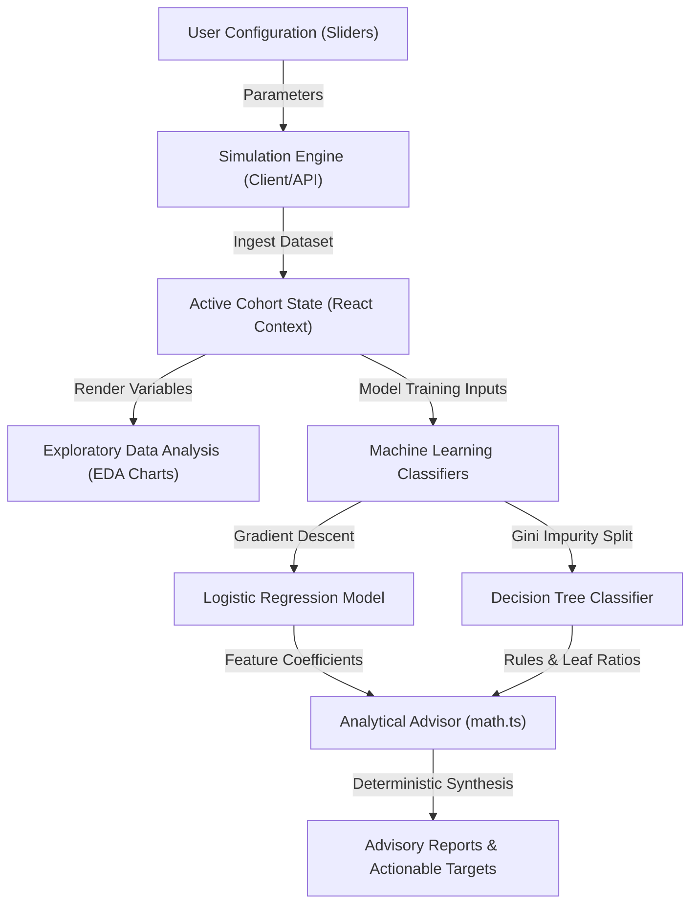

# Customer Retention Analysis Suite

An interactive, research-grade analytical suite designed to simulate customer behavior cohort profiles, run multivariate machine learning classification models, map exploratory correlation matrices, and generate data-driven product retention strategies. 

This project was built as a BSc Computer Science dissertation tool at **Lagos State University of Science and Technology (LASUSTECH)**.

---

## 📊 Flowchart & System Workflow

The following diagram illustrates the data flow and operational lifecycle of the Customer Retention Analysis Suite:



---

## 💡 What the Website Does

The platform is designed to bridge the gap between abstract machine learning theory and practical SaaS product management. It helps users:
1. **Synthesize Cohorts**: Dynamically generate cohorts of simulated customers based on variables like support ticket complaints, purchase frequency, monthly spending, app login activity, and applied discounts.
2. **Train Classifiers in Real-time**: Train multivariate **Logistic Regression** and **Decision Tree** models directly on the customized dataset to predict customer churn.
3. **Map Behavioral Interdependencies**: Calculate and render a Pearson Correlation matrix heatmap to identify which user habits correspond to high retention or high attrition.
4. **Formulate Retention Actions**: Automatically interpret mathematical regression weights into human-readable product development strategies.

---

## ⚙️ How It Works

1. **Cohort Simulation**: A stochastic cohort generator calculates churn probabilities for each profile using a sigmoid logistic function approximation:
   $$z = \beta_0 + \beta_1(\text{Logins}) + \beta_2(\text{Purchases}) + \beta_3(\text{Complaints}) + \beta_4(\text{Tenure}) + \beta_5(\text{Discount})$$
2. **Local Model Training**:
   - **Logistic Regression**: Runs batch Gradient Descent in the browser to optimize coefficients for purchase frequency, spend, login activity, and complaints count.
   - **Decision Tree**: Builds a depth-3 classification tree using Gini Impurity minimization to establish conditional decision logic.
3. **Advisory Report Generation**: A rule-based parser reads the resulting model weights and constructs tailored recommendations based on the primary churn driver.

---

## 🎯 Target Users

* **Dissertation Supervisor & Committee**: Evaluates the mathematical precision, model accuracy metrics (precision, recall, F1-score), and execution correctness.
* **SaaS Product Managers**: Reviews simulated cohort patterns to identify onboarding friction and usage drops.
* **Customer Success Leaders**: Understands the correlation between ticket count limits and customer attrition.

---

## 💡 Architecture & Tech Stack

### 1. Frontend (Client-Side)
- **Framework**: React 19 & TypeScript.
- **Bundler**: Vite.
- **Styling**: Tailwind CSS & Modern Glassmorphism.
- **Charts**: Recharts (fully responsive scientific chart components).
- **Animations**: Motion (micro-transitions).
- **Icons**: Lucide React.

### 2. Backend (Simulated Microservices Layer)
To make the application robust and production-ready, it features a dual-layer architecture. While it runs fully client-side as an offline-first fallback, it also includes Vercel Serverless Function endpoints:
- **Server Framework**: Express.js (Node.js runtime).
- **API Endpoints**:
  - `GET /api/health` — Service status.
  - `GET /api/customers` — Fetches baseline cohort profiles.
  - `POST /api/customers/simulate` — Re-runs the stochastic cohort generator.
  - `POST /api/analyze-models` — Trains the regression and tree classifiers.

---

## 💻 Script & Commands Reference

### Frontend Commands

To install and run the client-side environment locally:

```bash
# Install dependencies
npm install

# Run Vite dev server (runs SPA)
npm run dev

# Build the static single-page application
npm run vercel-build
```

### Backend & Local Server Commands

To run the full Express node server (which hosts both the static frontend assets and the server-side API endpoints):

```bash
# Build Vite SPA and bundle the Express server with esbuild
npm run build

# Start the bundled Node production server (port 3000)
npm run start

# Clean build artifact directories
npm run clean
```

---

## 🚀 Vercel Deployment

The project is pre-configured for Vercel Serverless Functions deployment using the `vercel.json` config:

1. Link and push the repository to GitHub.
2. Import the project into your Vercel Dashboard.
3. Vercel will automatically detect the `/api` directory as Serverless Functions and run the `npm run vercel-build` command to compile the React client into the `dist` output folder.
