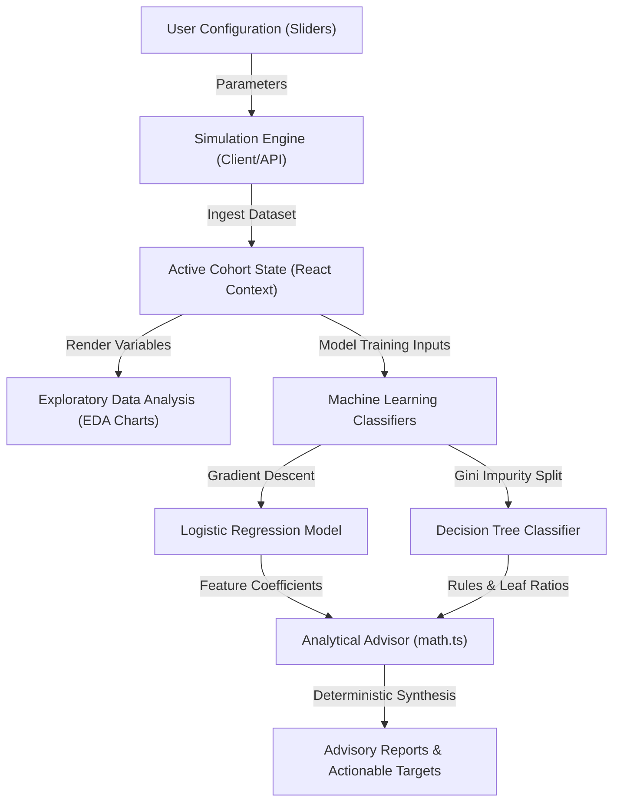

# Customer Retention Analysis Suite

An interactive, research-grade analytical suite designed to simulate customer behavior cohort profiles, run multivariate machine learning classification models, map exploratory correlation matrices, and generate data-driven product retention strategies. 

This project was built as a BSc Computer Science dissertation tool at **Lagos State University of Science and Technology (LASUSTECH)**.

---

## 📊 Flowchart & System Workflow

The following diagram illustrates the data flow and operational lifecycle of the Customer Retention Analysis Suite:



---

## 💡 What the Website Does

The platform is designed to bridge the gap between abstract machine learning theory and practical SaaS product management. It helps users:
1. **Synthesize Cohorts**: Dynamically generate cohorts of simulated customers based on variables like support ticket complaints, purchase frequency, monthly spending, app login activity, and applied discounts.
2. **Train Classifiers in Real-time**: Train multivariate **Logistic Regression** and **Decision Tree** models directly on the customized dataset to predict customer churn.
3. **Map Behavioral Interdependencies**: Calculate and render a Pearson Correlation matrix heatmap to identify which user habits correspond to high retention or high attrition.
4. **Formulate Retention Actions**: Automatically interpret mathematical regression weights into human-readable product development strategies.

---

## ⚙️ How It Works & Mathematical Formulations

### 1. Cohort Simulation
A stochastic cohort generator calculates churn probabilities for each profile using a sigmoid logistic function approximation:
$$z = \beta_0 + \beta_1(\text{Logins}) + \beta_2(\text{Purchases}) + \beta_3(\text{Complaints}) + \beta_4(\text{Tenure}) + \beta_5(\text{Discount})$$

The final churn state is assigned as:
$$\text{Churn Status} = \begin{cases} 1 & \text{if } \frac{1}{1 + e^-z} \ge 0.55 \\ 0 & \text{otherwise} \end{cases}$$

### 2. Local Model Training Algorithms
- **Logistic Regression (Batch Gradient Descent)**:
  Features are first normalized using Standard Scaling to ensure convergence stability:
  $$X_{\text{scaled}} = \frac{X - \mu}{\sigma}$$
  Weights are updated iteratively across $epochs$ using the gradient of the Binary Cross-Entropy loss:
  $$W_j := W_j - \frac{\alpha}{m} \sum_{i=1}^m \left( \sigma(W^T x^{(i)} + b) - y^{(i)} \right) x_j^{(i)}$$
  $$b := b - \frac{\alpha}{m} \sum_{i=1}^m \left( \sigma(W^T x^{(i)} + b) - y^{(i)} \right)$$

- **Decision Tree (Gini Impurity Splits)**:
  Constructs a depth-3 classification tree. At each node, the algorithm searches for a feature and threshold value that splits the data to maximize the **Gini Gain** (Information Gain):
  $$I_G(S) = 1 - (p_{\text{retained}}^2 + p_{\text{churned}}^2)$$
  $$\text{Gain} = I_G(S) - \left( \frac{|S_{\text{left}}|}{|S|} I_G(S_{\text{left}}) + \frac{|S_{\text{right}}|}{|S|} I_G(S_{\text{right}}) \right)$$

- **Pearson Correlation Coefficients**:
  Calculates linear correlation pairs between behavioral variables:
  $$r_{xy} = \frac{\sum_{i=1}^n (x_i - \bar{x})(y_i - \bar{y})}{\sqrt{\sum_{i=1}^n (x_i - \bar{x})^2 \sum_{i=1}^n (y_i - \bar{y})^2}}$$

---

## 🎯 Target Users

* **Dissertation Supervisor & Committee**: Evaluates the mathematical precision, model accuracy metrics (precision, recall, F1-score), and execution correctness.
* **SaaS Product Managers**: Reviews simulated cohort patterns to identify onboarding friction and usage drops.
* **Customer Success Leaders**: Understands the correlation between ticket count limits and customer attrition.

---

## 📁 File Structure & Directory Tree

```text
Customer_Retention_Analysis_Suite/
├── .vercel/               # Vercel deployment link configurations
├── api/                   # Serverless backend endpoints
│   ├── customers/         # Cohort data handling
│   │   ├── index.ts       # Baseline cohort provider
│   │   └── simulate.ts    # Stochastic simulation generator
│   ├── _shared.ts         # Shared controllers & prompts
│   ├── analyze-models.ts  # ML model analysis dispatcher
│   └── health.ts          # Server check route
├── src/                   # React SPA codebase
│   ├── components/        # Modularity components
│   │   ├── AIConsultant.tsx     # Analytical Advisor layout
│   │   ├── DataSimulator.tsx    # Cohort configuration sliders
│   │   ├── ExploratoryCharts.tsx# Scatter plots and Heatmaps
│   │   ├── ModelTrainer.tsx     # Inference & confusion matrices
│   │   └── ProposalOverview.tsx # LASUSTECH proposal metadata layout
│   ├── utils/
│   │   └── math.ts        # Math engines (Logistic Regression, Gini Tree, Pearson)
│   ├── App.tsx            # Core context, routers, & API fallbacks
│   ├── index.css          # Design system stylesheet
│   ├── main.tsx           # React mounting controller
│   ├── mockData.ts        # Baseline cohorts & stochastic names dictionary
│   └── types.ts           # Type bindings
├── vercel.json            # Deployment routing
├── vite.config.ts         # Vite bundler rules
├── tsconfig.json          # TypeScript definitions
├── package.json           # Task scripts & dependency configurations
└── README.md              # Documentation
```

---

## 🔌 API Endpoints Reference

| Endpoint | Method | Payload Parameters | Response JSON |
| :--- | :--- | :--- | :--- |
| `/api/health` | `GET` | None | `{ "status": "healthy", "databaseSize": 30 }` |
| `/api/customers` | `GET` | None | `{ "success": true, "customers": [...] }` |
| `/api/customers/simulate` | `POST` | `{ "count": 35, "complaintUrgency": 1.2, "retentionDiscountRatio": 0.5, "avgTenure": 12 }` | `{ "success": true, "message": "...", "customers": [...] }` |
| `/api/analyze-models` | `POST` | `{ "customers": [...] }` | `{ "success": true, "logisticRegression": {...}, "decisionTree": {...}, "correlationMatrix": [...] }` |

---

## 🛠️ Architecture & Tech Stack

### 1. Frontend (Client-Side)
- **Framework**: React 19 & TypeScript.
- **Bundler**: Vite.
- **Styling**: Tailwind CSS & Modern Glassmorphism.
- **Charts**: Recharts (fully responsive scientific chart components).
- **Animations**: Motion (micro-transitions).
- **Icons**: Lucide React.

### 2. Backend (Simulated Microservices Layer)
To make the application robust and production-ready, it features a dual-layer architecture. While it runs fully client-side as an offline-first fallback, it also includes Vercel Serverless Function endpoints:
- **Server Framework**: Express.js (Node.js runtime).
- **Compilation rules**: The backend uses Vercel serverless function compilers pointing to TypeScript entry points under the `/api` directory.

---

## 💻 Script & Commands Reference

### Frontend Commands

To install and run the client-side environment locally:

```bash
# Install dependencies
npm install

# Run Vite dev server (runs SPA)
npm run dev

# Build the static single-page application
npm run vercel-build
```

### Backend & Local Server Commands

To run the full Express node server (which hosts both the static frontend assets and the server-side API endpoints):

```bash
# Build Vite SPA and bundle the Express server with esbuild
npm run build

# Start the bundled Node production server (port 3000)
npm run start

# Clean build artifact directories
npm run clean
```

---

## 🚀 Vercel Deployment

The project is pre-configured for Vercel Serverless Functions deployment using the `vercel.json` config:

1. Link and push the repository to GitHub.
2. Import the project into your Vercel Dashboard.
3. Vercel will automatically detect the `/api` directory as Serverless Functions and run the `npm run vercel-build` command to compile the React client into the `dist` output folder.
